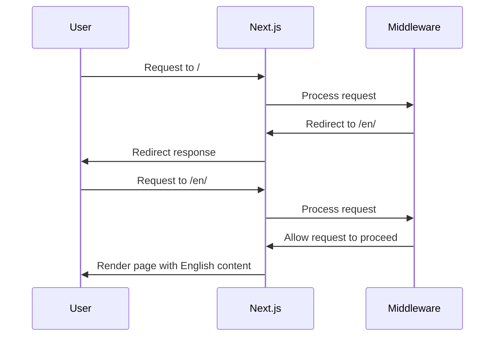
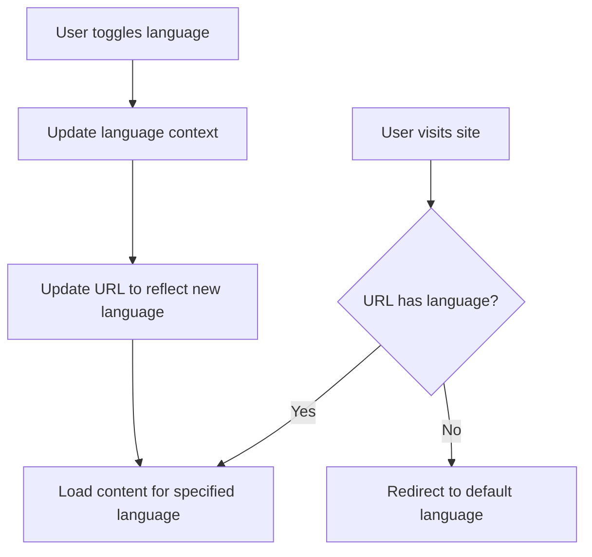

# Language-Based Routing Implementation Plan

This document outlines the plan for implementing language-based routing in the Antigua Digital Landing Page project, allowing content to be displayed based on URL patterns like `<host-url>/en/` or `<host-url>/es/`.

## Overview

We'll implement a solution that:

1. Uses URL patterns like `/en/` and `/es/` to determine which language content to display
2. Redirects users from the root URL to a default language (e.g., `/en/`)
3. Updates the URL when users switch languages via the language toggle
4. Is scalable to support additional languages in the future

## Implementation Approach

We'll use Next.js middleware for redirects and language validation, while maintaining a simplified app structure with a language-specific layout that detects the language from the URL.

### 1. Next.js Middleware for Redirects

We'll create a middleware that:

- Redirects requests to the root URL (`/`) to the default language path (`/en/`)
- Validates language paths to ensure they're supported
- Handles language detection and redirection



### 2. App Router Structure

Since all content is language-specific, we will use a single layout located inside the `[lang]` segment. We do not need a global root layout.

```
src/
  app/
    [lang]/       # Dynamic segment for language
      layout.tsx  # Language-specific layout
      page.tsx    # Main page component
      ...         # Other pages
```

### 3. Language Context Updates

We'll update the language context to:

- Read the language from the URL path
- Update the URL when the language is changed
- Maintain synchronization between the URL and the language context



## Detailed Implementation Steps

### Step 1: Create Middleware for Language Routing

```ts
// src/middleware.ts
import { NextResponse } from 'next/server';
import type { NextRequest } from 'next/server';

export const supportedLanguages = ['en', 'es'];
export const defaultLanguage = 'en';

export function middleware(request: NextRequest) {
  const { pathname } = request.nextUrl;

  const pathnameHasLanguage = supportedLanguages.some(
    (lang) => pathname.startsWith(`/${lang}/`) || pathname === `/${lang}`
  );

  if (!pathnameHasLanguage) {
    return NextResponse.redirect(
      new URL(`/${defaultLanguage}${pathname === '/' ? '' : pathname}`, request.url)
    );
  }

  return NextResponse.next();
}

export const config = {
  matcher: ['/((?!_next|api|favicon.ico).*)'],
};
```

### Step 2: Create Language-Specific Layout

Create `[lang]/layout.tsx` and remove any need for a root layout.

### Step 3: Update Language Context

```ts
// src/context/languageContext.tsx
'use client';
import { createContext, useContext, useState, useEffect, ReactNode } from 'react';
import { usePathname, useRouter } from 'next/navigation';

type Language = 'en' | 'es';

interface LanguageContextType {
  language: Language;
  setLanguage: (lang: Language) => void;
  toggleLanguage: () => void;
}

const LanguageContext = createContext<LanguageContextType | undefined>(undefined);

export function LanguageProvider({ 
  children,
  initialLanguage = 'en'
}: { 
  children: ReactNode;
  initialLanguage: Language;
}) {
  const [language, setLanguageState] = useState<Language>(initialLanguage);
  const router = useRouter();
  const pathname = usePathname();

  const setLanguage = (newLanguage: Language) => {
    setLanguageState(newLanguage);
    if (pathname) {
      const segments = pathname.split('/');
      segments[1] = newLanguage;
      router.replace(segments.join('/'));
    }
  };

  const toggleLanguage = () => {
    const newLanguage = language === 'en' ? 'es' : 'en';
    setLanguage(newLanguage);
  };

  useEffect(() => {
    try {
      localStorage.setItem('language', language);
      document.documentElement.lang = language;
    } catch (error) {
      console.warn('Error setting localStorage:', error);
    }
  }, [language]);

  return (
    <LanguageContext.Provider value={{ language, setLanguage, toggleLanguage }}>
      {children}
    </LanguageContext.Provider>
  );
}

export function useLanguage() {
  const context = useContext(LanguageContext);
  if (context === undefined) {
    throw new Error('useLanguage must be used within a LanguageProvider');
  }
  return context;
}
```

### Step 4: Update `[lang]/layout.tsx`

```tsx
// src/app/[lang]/layout.tsx
import { ReactNode } from 'react';
import { notFound } from 'next/navigation';
import { LanguageProvider } from '@/context/languageContext';
import Head from 'next/head';

const locales = ['en', 'es'];

export default function LocaleLayout({
  children,
  params,
}: {
  children: ReactNode;
  params: { lang: string };
}) {
  const lang = locales.includes(params.lang) ? params.lang : null;
  if (!lang) notFound();

  const host = typeof window !== 'undefined' ? window.location.origin : 'https://example.com';

  return (
    <html lang={lang}>
      <Head>
        {locales.map((locale) => (
          <link
            key={locale}
            rel="alternate"
            hrefLang={locale}
            href={`${host}/${locale}`}
          />
        ))}
        <link rel="alternate" hrefLang="x-default" href={`${host}/en`} />
      </Head>
      <body>
        <LanguageProvider initialLanguage={lang}>{children}</LanguageProvider>
      </body>
    </html>
  );
}
```

### Step 5: Create Language-Specific Pages

```tsx
// src/app/[lang]/page.tsx
import {
  Footer,
  WhyChoose,
  WhyChooseTwo,
  Slider,
  Navbar,
  Contact,
  FAQ,
  Hero,
  Features,
} from '@/components';

export default function Home() {
  return (
    <>
      <Navbar />
      <Hero />
      <WhyChoose />
      <WhyChooseTwo />
      <Features />
      <Slider />
      <Contact />
      <FAQ />
      <Footer />
    </>
  );
}
```

### Step 6: Update Components and Links

Use `useParams` in client components only:

```tsx
'use client';
import { useParams } from 'next/navigation';
import { getHeroContent } from '@/lib/i18n';

export function Hero() {
  const params = useParams();
  const lang = params.lang as string || 'en';
  const content = getHeroContent(lang);

  return <h1>{content.title}</h1>;
}
```

Navigation:

```tsx
import Link from 'next/link';
import { useParams } from 'next/navigation';

export function Navigation() {
  const params = useParams();
  const lang = params.lang as string;

  return (
    <nav>
      <Link href={`/${lang}/about`}>About</Link>
      <Link href={`/${lang}/contact`}>Contact</Link>
    </nav>
  );
}
```

## Testing Plan

1. Test redirects from root URL to default language
2. Test direct access to language-specific URLs
3. Test language toggle functionality
4. Test navigation between pages while maintaining language
5. Test browser back/forward navigation

## Fallback Strategy

1. Middleware redirects invalid language routes to default language
2. Error logging captures invalid language attempts

## Minor Suggestions for Improvement

- Avoid duplicating layout logic — use `[lang]/layout.tsx` only
- Use `router.replace()` instead of `push()` for locale change
- Use `params` for locale in server components, `useParams` in client ones
- Move translations to JSON or `lib/i18n/*.ts` files

## Future Enhancements

1. Language detection from browser headers
2. Regional variants (e.g., `en-US`, `es-MX`)
3. SEO with `<link hreflang>` (✅ done)
4. External translation sources

## Conclusion

This plan gives you full language-based routing and SEO in Next.js 15 using dynamic routes, middleware, and layout-per-locale structure.

