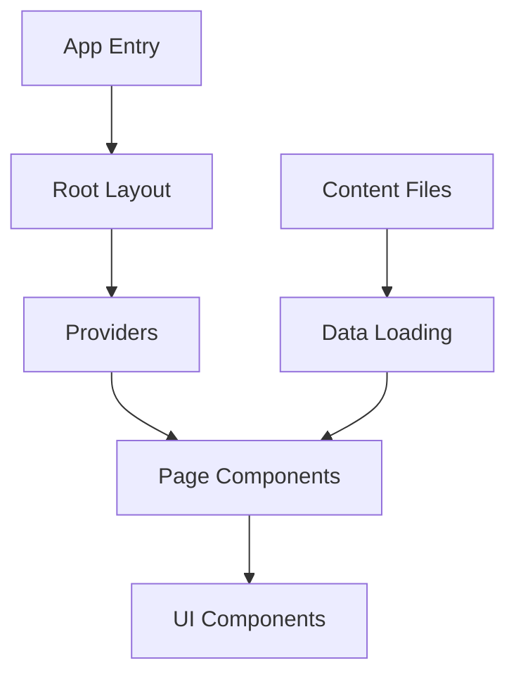
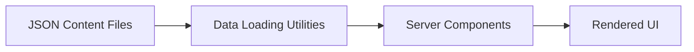

# System Patterns: Antigua Digital Landing Page

## Architecture Overview
The Antigua Digital Landing Page follows a modern Next.js 15 architecture with the App Router pattern, leveraging React 19's latest features. The system is designed with a clear separation of concerns and a component-based approach.

## Key Design Patterns

### Content Management
The project uses a file-based content management approach:
- JSON files in the `/content` directory store structured content
- Data loading utilities in `/src/lib/data.ts` handle content retrieval
- Server components load content during rendering
- This approach allows for easy content updates without code changes

### UI Component Structure
The UI follows a component-based architecture with:
- Material UI as the primary component library
- Framer Motion for animations
- Custom styling through a combination of component props and global CSS

### Theme Management
The project implements a theming system:
- Material UI theme for component styling
- Global CSS variables for fundamental styling properties
- Dark/light mode support through CSS variables and media queries

### Rendering Strategy
The application uses Next.js App Router with:
- Server components for content-heavy sections
- Client components for interactive elements
- Static rendering for performance optimization
- Metadata API for SEO optimization

## Component Relationships

### Provider Pattern
The application uses a Provider pattern to manage global state and theming:
- `Providers` component wraps the application to provide context
- ThemeProvider supplies Material UI theming
- AnimatePresence enables page transition animations

### Data Flow
Data flows through the application in a unidirectional pattern:
- Content is loaded from JSON files using data utilities
- Page components receive content through props
- UI components render based on the provided content
- Interactive elements trigger client-side actions

## Technical Decisions

### Framework Selection
- **Next.js 15**: Chosen for its server component support, rendering optimizations, and simplified routing
- **React 19**: Utilized for its latest performance improvements and features

### UI Library Choices
- **Material UI**: Selected for its comprehensive component system, icon library, and theming capabilities
- **Framer Motion**: Implemented for high-quality animations and transitions

### Styling Approach
- Component-based styling through Material UI props and the sx prop
- Global CSS for fundamental styling and variables
- CSS variables for theme switching and responsive design

### Deployment Strategy
- GitHub Actions for CI/CD pipeline
- Vercel for hosting and edge network distribution
- Automated builds and deployments on main branch changes
