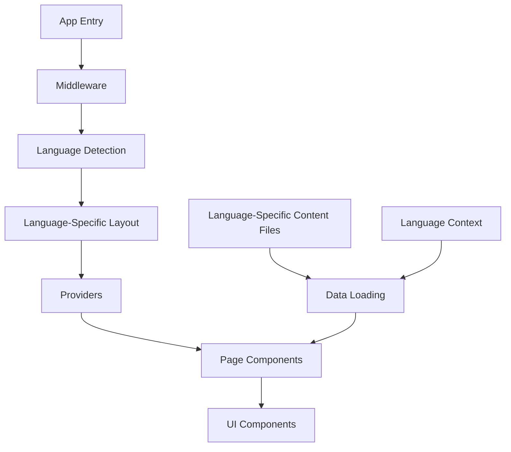
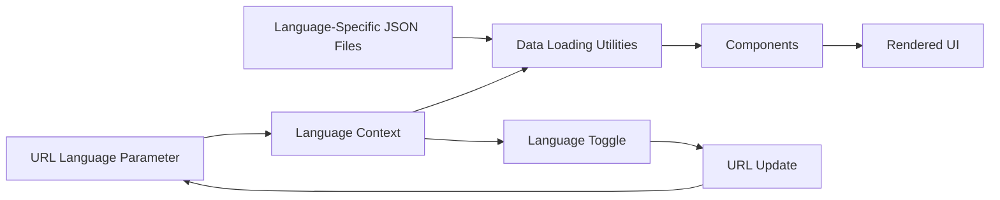

# System Patterns: Antigua Digital Landing Page

## Architecture Overview

The Antigua Digital Landing Page follows a modern Next.js 15 architecture with the App Router pattern, leveraging React 19's latest features. The system is designed with a clear separation of concerns and a component-based approach, with language-based routing for multilingual support.

## Key Design Patterns

### Content Management

The project uses a language-based content management approach:

- JSON files in the `/src/content/en` and `/src/content/es` directories store structured content by language
- Data loading utilities in `/src/lib/data.ts` handle content retrieval based on the URL language parameter
- Middleware handles language detection and redirection to the appropriate language path
- Components use the language context to load the appropriate translations
- This approach allows for easy content updates and multilingual support without code changes

### UI Component Structure

The UI follows a component-based architecture with:

- Material UI as the primary component library
- Framer Motion for animations
- Custom styling through a combination of component props and global CSS
- Custom reusable components for consistent UI patterns

#### Custom Components

The project includes several custom components that should be used whenever possible:

- **Section**: A wrapper component for page sections that provides consistent styling, spacing, and container behavior
- **GradientText**: A component for rendering text with gradient styling
- **MotionComponents**: Wrapped Material UI components with Framer Motion for animations

### Theme Management

The project implements a theming system:

- Material UI theme for component styling
- Global CSS variables for fundamental styling properties
- Dark/light mode support through CSS variables and media queries

### Rendering Strategy

The application uses Next.js App Router with:

- Server components for content-heavy sections
- Client components for interactive elements
- Static rendering for performance optimization
- Metadata API for SEO optimization

## Component Relationships

### Provider Pattern

The application uses a Provider pattern to manage global state and theming:

- `Providers` component wraps the application to provide context
- ThemeProvider supplies Material UI theming
- LanguageProvider manages language state and switching
- AnimatePresence enables page transition animations

### Language-Based Routing

The application implements language-based routing:

- URL patterns like `/en/` and `/es/` determine which language content to display
- Middleware redirects users from the root URL to a default language (e.g., `/en/`)
- Language context reads the language from the URL path
- Language toggle updates the URL when the language is changed
- SEO is optimized with proper hreflang tags

### Data Flow

Data flows through the application in a unidirectional pattern:

- Language is determined from the URL path
- Content is loaded from language-specific JSON files using data utilities
- Page components receive content through props based on the current language
- UI components render based on the provided content
- Interactive elements trigger client-side actions

## Technical Decisions

### Framework Selection

- **Next.js 15**: Chosen for its server component support, rendering optimizations, and simplified routing
- **React 19**: Utilized for its latest performance improvements and features

### UI Library Choices

- **Material UI**: Selected for its comprehensive component system, icon library, and theming capabilities
- **Framer Motion**: Implemented for high-quality animations and transitions

### Styling Approach

- Component-based styling through Material UI props and the sx prop
- Global CSS for fundamental styling and variables
- CSS variables for theme switching and responsive design

### Internationalization Strategy

- Language-based routing with URL patterns (`/en/`, `/es/`)
- Language context for managing the current language
- Language-specific content files for translations
- SEO optimization with hreflang tags
- Middleware for language detection and redirection

### Deployment Strategy

- GitHub Actions for CI/CD pipeline
- Vercel for hosting and edge network distribution
- Automated builds and deployments on main branch changes
