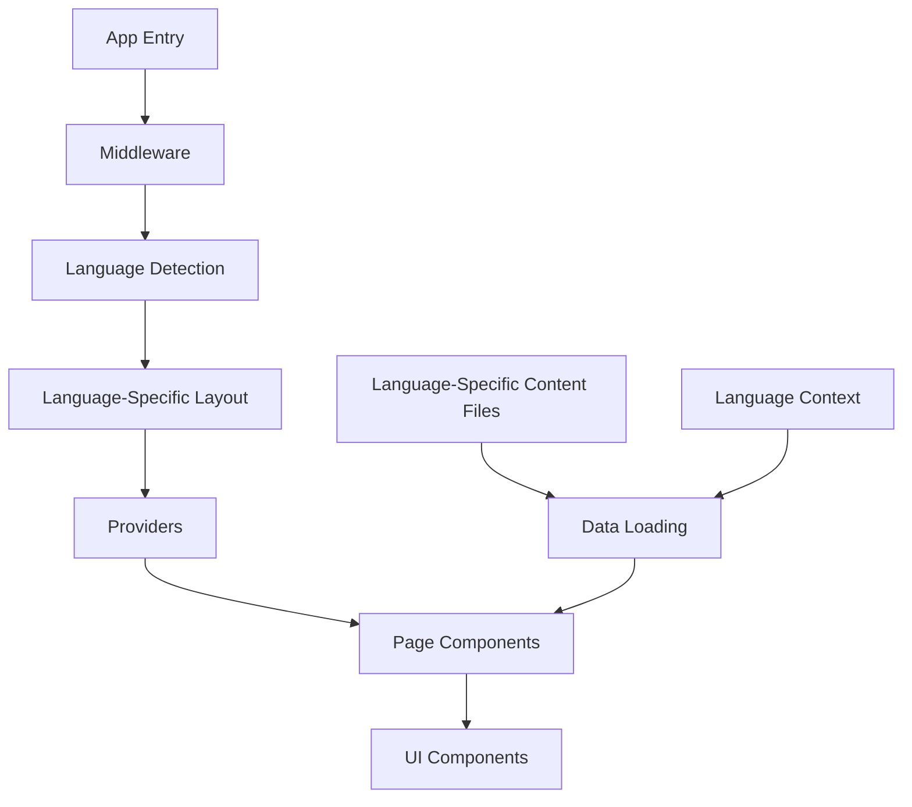
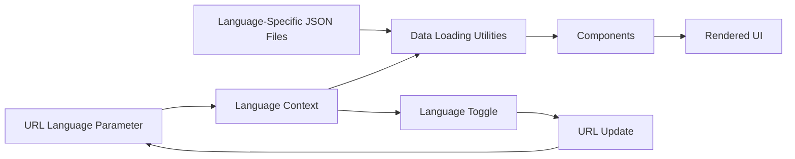

# System Patterns: Aguat Solutions Landing Page

## Architecture Overview

The Aguat Solutions Landing Page follows a modern Next.js 15 architecture with the App Router pattern, leveraging React 19's latest features. The system is designed with a clear separation of concerns and a component-based approach, with language-based routing for multilingual support.



## Key Design Patterns

### Content Management

The project uses a language-based content management approach:

- JSON files in the `/src/content/en` and `/src/content/es` directories store structured content by language
- Data loading utilities in `/src/lib/data.ts` handle content retrieval based on the URL language parameter
- Middleware handles language detection and redirection to the appropriate language path
- Components use the language context to load the appropriate translations
- This approach allows for easy content updates and multilingual support without code changes



### UI Component Structure

The UI follows a component-based architecture with:

- Material UI as the primary component library
- Framer Motion for animations
- Custom styling through a combination of component props and global CSS
- Custom reusable components for consistent UI patterns

#### Component Organization

The project organizes components into logical categories:

- `/components/common`: Shared utility components like Section and ScrollPreserver
- `/components/layout`: Structural components like Navbar, Footer, and MobileMenu
- `/components/sections`: Page section components like Hero, Features, and Contact
- `/components/ui`: UI utility components like GradientText, BlurText, and ThemeToggle

#### Custom Components

The project includes several custom components that should be used whenever possible:

- **Section**: A wrapper component for page sections that provides consistent styling, spacing, and container behavior with built-in animations
- **GradientText**: A component for rendering text with gradient styling
- **MotionComponents**: Wrapped Material UI components with Framer Motion for animations
- **SpotlightCard**: Interactive card component with spotlight effect
- **CounterUp**: Animated counter component for statistics

#### Section Component Example

The Section component is a key building block that encapsulates consistent styling and animations:

```tsx
// Usage example
<Section
  id="hero"
  animation="fadeInUp"
  animationDelay={0.3}
  sx={{
    paddingTop: { xs: 8, md: 10, lg: 12 },
    backgroundColor: colors.gradientBackground,
  }}
>
  {/* Section content */}
</Section>
```

The Section component accepts these props:
- `id`: Optional string for section identification
- `animation`: Animation type ('fadeIn', 'fadeInUp', 'fadeInDown', 'fadeInLeft', 'fadeInRight', 'stagger')
- `animationDelay`: Number in seconds to delay the animation
- `sx`: Material UI's sx prop for additional styling
- `children`: React nodes for section content

This approach ensures consistent spacing, animations, and styling across all page sections.

### Theme Management

The project implements a theming system:

- Material UI theme for component styling
- Global CSS variables for fundamental styling properties
- Dark/light mode support through CSS variables and media queries
- ThemeContext for managing theme state and preferences

### Rendering Strategy

The application uses Next.js App Router with:

- Server components for content-heavy sections
- Client components for interactive elements (marked with 'use client' directive)
- Static rendering for performance optimization
- Metadata API for SEO optimization

## Component Relationships

### Provider Pattern

The application uses a Provider pattern to manage global state and theming:

- `Providers` component wraps the application to provide context
- ThemeProvider supplies Material UI theming
- LanguageProvider manages language state and switching
- SidebarProvider manages sidebar state for mobile navigation
- AnimatePresence enables page transition animations

### Language-Based Routing

The application implements language-based routing:

- URL patterns like `/en/` and `/es/` determine which language content to display
- Middleware redirects users from the root URL to a default language (e.g., `/en/`)
- Language context reads the language from the URL path
- Language toggle updates the URL when the language is changed
- SEO is optimized with proper hreflang tags

#### Middleware Implementation

The middleware handles language detection and redirection:

```typescript
// middleware.ts
export function middleware(request: NextRequest) {
  const { pathname } = request.nextUrl;
  const supportedLanguages = ['en', 'es'];
  const defaultLanguage = 'en';

  const pathnameHasLanguage = supportedLanguages.some(
    lang => pathname.startsWith(`/${lang}/`) || pathname === `/${lang}`,
  );

  if (!pathnameHasLanguage) {
    return NextResponse.redirect(
      new URL(`/${defaultLanguage}${pathname === '/' ? '' : pathname}`, request.url),
    );
  }

  return NextResponse.next();
}
```

#### Language Context Usage

The language context is provided at the layout level and used throughout the application:

```tsx
// In layout.tsx
<LanguageProvider initialLanguage={lang as 'en' | 'es'}>
  {/* Application content */}
</LanguageProvider>

// In components
const { language, toggleLanguage } = useLanguage();
```

#### Content Loading Example

Content is loaded based on the current language:

```tsx
// In page.tsx
const { lang } = await params;
const content = getHomePageContent(lang);

// In components
<Hero content={content.hero} />
```

### Data Flow

Data flows through the application in a unidirectional pattern:

- Language is determined from the URL path
- Content is loaded from language-specific JSON files using data utilities
- Page components receive content through props based on the current language
- UI components render based on the provided content
- Interactive elements trigger client-side actions

## Technical Decisions

### Framework Selection

- **Next.js 15**: Chosen for its server component support, rendering optimizations, and simplified routing
- **React 19**: Utilized for its latest performance improvements and features

### UI Library Choices

- **Material UI**: Selected for its comprehensive component system, icon library, and theming capabilities
- **Framer Motion**: Implemented for high-quality animations and transitions

#### Animation Integration

The project integrates Framer Motion with Material UI components:

```typescript
// Motion-wrapped Material UI components
export const MotionBox = motion.create(Box);
export const MotionButton = motion.create(Button);
export const MotionTypography = motion.create(Typography);
export const MotionCard = motion.create(Card);
```

#### Animation Variants

Predefined animation variants ensure consistent animations:

```typescript
// Animation variants
export const fadeVariant: Variants = {
  initial: { opacity: 0 },
  animate: {
    opacity: 1,
    transition: { duration: 0.5, ease: 'easeOut' },
  },
};

export const slideUpVariant: Variants = {
  initial: { opacity: 0, y: 50 },
  animate: {
    opacity: 1,
    y: 0,
    transition: { duration: 0.5, ease: 'easeOut' },
  },
};
```

#### Animation Props

Reusable animation props simplify component animations:

```typescript
// Animation props
export const fadeInUpProps = {
  initial: { opacity: 0, y: 20 },
  animate: { opacity: 1, y: 0 },
  transition: { duration: 0.5 },
};

// Usage in components
<MotionTypography
  variant="h1"
  {...slideLeftVariant}
  sx={{ fontSize: { xs: '2.25rem', md: '3rem' } }}
>
  {textWithGradient(content.title)}
</MotionTypography>
```

### Styling Approach

- Component-based styling through Material UI props and the sx prop
- Global CSS for fundamental styling and variables
- CSS variables for theme switching and responsive design

### Internationalization Strategy

- Language-based routing with URL patterns (`/en/`, `/es/`)
- Language context for managing the current language
- Language-specific content files for translations
- SEO optimization with hreflang tags
- Middleware for language detection and redirection

### Deployment Strategy

- GitHub Actions for CI/CD pipeline
- Vercel for hosting and edge network distribution
- Automated builds and deployments on main branch changes

## Performance Considerations

- Server components reduce client-side JavaScript
- Image optimization with Next.js Image component
- CSS-in-JS for efficient styling
- Code splitting for optimal bundle sizes
- Lazy loading for non-critical components

## Accessibility Patterns

- Semantic HTML structure
- ARIA attributes for interactive elements
- Keyboard navigation support
- Color contrast compliance
- Screen reader compatibility

## Error Handling

- Fallback UI for error states
- Graceful degradation for missing content
- Default language fallback for missing translations
- Proper error boundaries for component failures
